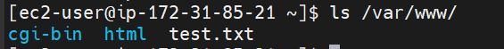
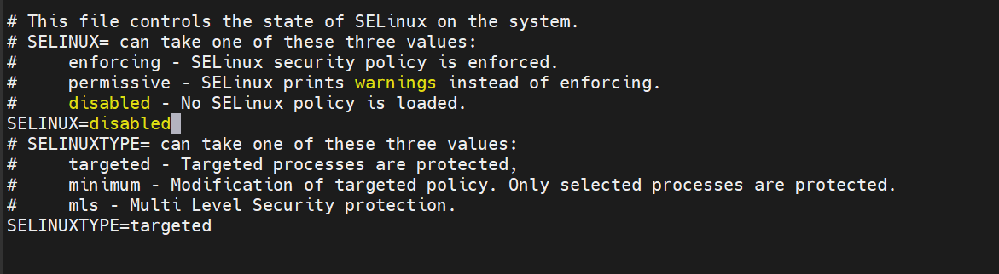

# DEVOPS TOOLING WEBSITE SOLUTION

**3 TIER WEB APPLICATION ARCHITECTURE WITH A SINGLE DATABASE SERVER AND NFS SERVER AS A SHARED FILE STORAGE**

## STEP 1 - CONFIGURE NFS SERVER

Launch a redhat ec2 instance with 3 EBS volumes attached

Create a single partion of each disk using gdisk, 

`sudo gdisk /dev/xvdb`

`sudo gdisk /dev/xvdc`

`sudo gdisk /dev/xvdd`

Install logical volume manager 

`sudo yum install lvm2`

 

 Mark each disk as physical volumes using PVCREATE and verify 

 `sudo pvcreate /dev/xvdb1`
 
 `sudo pvcreate /dev/xvdc1`
 
 `sudo pvcreate /dev/xvdd1`

`sudo pvs`

 

 Create a volume group using vgcreate and verify

 `sudo vgcreate nfs-vg /dev/xvdb1 /dev/xvdc1 /dev/xvdd1`

 

 Create 3 logical volumes lv-apps, lv-logs and lv-opt and verify

 `sudo lvcreate -n lv-apps -L 8G nfs-vg`

`sudo lvcreate -n lv-logs -L 2G nfs-v`

`sudo lvcreate -n lv-opt -L 10G nfs-v`
 
 `sudo lvs`

 

 Format logical volumes with xfs filesystem

`sudo mkfs -t xfs /dev/nfs-vg/lv-apps`

`sudo mkfs -t xfs /dev/nfs-vg/lv-logs`

`sudo mkfs -t xfs /dev/nfs-vg/lv-opt`

Create mount points on /mnt directory and mount logical volumes

`sudo mkdir /mnt/apps`

`sudo mkdir /mnt/logs`

`sudo mkdir /mnt/opt`

`sudo mount /dev/nfs-vg/lv-apps /mnt/apps`

`sudo mount /dev/nfs-vg/lv-logs /mnt/logs`

`sudo mount /dev/nfs-vg/lv-opt /mnt/opt`
 
 Update /etc/fstab with the configuration

 `sudo vi /etc/fstab`

Test configuration and reload daemon

`sudo mount -a`

`sudo systemctl daemon-reload`

Verify setup 

`df -h`

Install NFS server 

`sudo yum -y update`

`sudo yum install nfs-utils -y`

`sudo systemctl start nfs-server.service`

`sudo systemctl enable nfs-server.service`

`sudo systemctl status nfs-server.service`

Set up permission that will allow Web servers to read, write and execute files on NFS

`sudo chown -R nobody: /mnt/apps`

`sudo chown -R nobody: /mnt/logs`

`sudo chown -R nobody: /mnt/opt`

`sudo chmod -R 777 /mnt/apps`

`sudo chmod -R 777 /mnt/logs`

`sudo chmod -R 777 /mnt/opt`

`sudo systemctl restart nfs-server.service`

Configure access to NFS for clients within the same subnet 

`sudo vi /etc/exports`

`sudo exportfs -arv`

Edit inbound rules for ec2 instance to allow traffic through tcp 111, udp 111 and udp 2049

## STEP 2 - CONFIGURE DATABASE SERVER

Create an ubuntu ec2 instance

Update Ubuntu 

`sudo apt update`

Install mysql

`sudo apt install mysql-server`

Create database tooling

`mysql> Create database tooling;`

create database user webaccess

`CREATE USER 'webaccess'@'172.31.80.0/20' IDENTIFIED BY 'password';`

Grant permission to webaccess user on tooling database to do anything only from the webservers subnet cidr

`mysql> GRANT ALL PRIVILEGES ON tooling.* to 'webaccess'@'172.31.80.0/20';`

## STEP 3 CONFIGURE STATELESS WEBSERVERS

Launch 3 redhat ec2 instances and repeat following steps for the servers

`sudo yum update`

Install NFS client

`sudo yum install nfs-utils nfs4-acl-tools -y`

Mount /var/www/ and target the NFS server’s export for apps

`sudo mkdir /var/www`

`sudo mount -t nfs -o rw,nosuid 172.31.89.244:/mnt/apps /var/www`

Add configuration to fstab file

`sudo vi /etc/fstab`

Install Remi’s repository, Apache and PHP

`sudo yum install httpd -y`

`sudo dnf install https://dl.fedoraproject.org/pub/epel/epel-release-latest-8.noarch.rpm`

`sudo dnf install dnf-utils http://rpms.remirepo.net/enterprise/remi-release-8.rpm`

`sudo dnf module reset php`

`sudo dnf module enable php:remi-7.4`

`sudo dnf install php php-opcache php-gd php-curl php-mysqlnd`

`sudo systemctl start php-fpm`

`sudo systemctl enable php-fpm`

`setsebool -P httpd_execmem 1`

Test NFS server by creating a file on a webserver and verifying if it exists on another webserver

Mount log folder for Apache to NFS servers export for logs

Deployed tooling website code into /var/www/html

cloned tooling website code from github

`git clone https://github.com/ladifa1/tooling.git`

Copy contents in tooling html folder to webservers var/www/html folder 

`cd /tooling`

`sudo cp -R html/. /var/www/html`

Disable SELinux 

`sudo setenforce 0`

Permanently disable SELinux by editing configuration

`sudo vi /etc/sysconfig/selinux`

Update the website’s configuration to connect to the database

sudo vi /var/www/html/functions.php

Install mysql on webservers

`sudo yum install mysql -y`

Apply tooling-db.sql script to database

`mysql -h 172.31.81.206 -u webaccess -p tooling < tooling-db.sql`

Open website in browser

